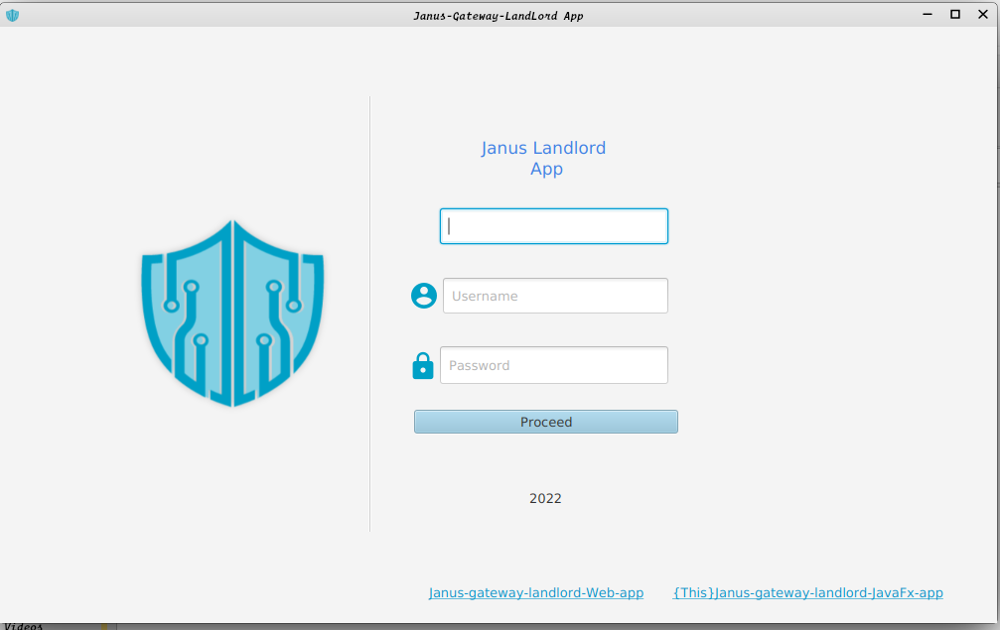
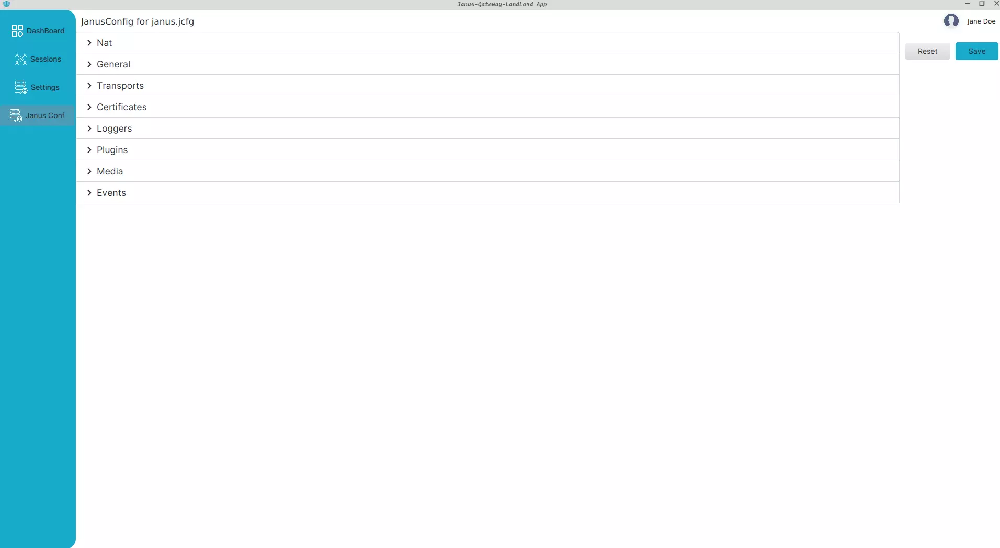
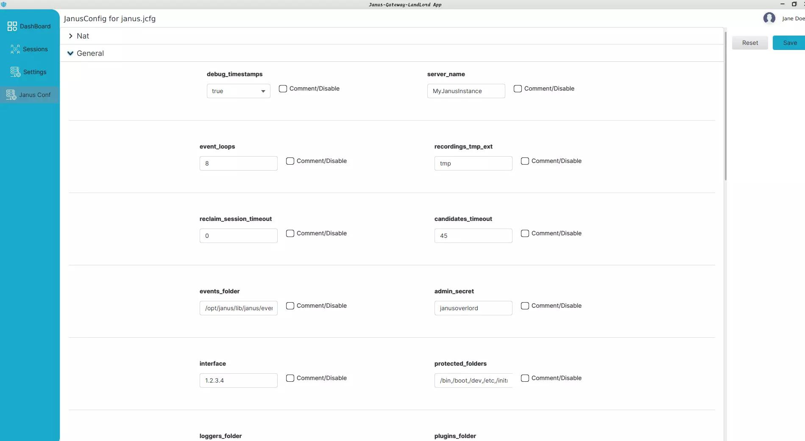

# Janus-Gateway Landlord JavaFX Client Application.

     

<figure>

</figure>

This is a client Admin Portal application to [Janus WebRTC Server](https://github.com/meetecho/janus-gateway). 
This client app is also a Admin Portal client to  [Janus-gateway-landlord-Web-app](https://github.com/kinsleykajiva/Janus-gateway-landlord-Web-app). 

This application can run on all Desktop platforms including Windows, Linux,Mac .

## Features include
- [Admin Monitor API requests](https://janus.conf.meetecho.com/docs/admin.html) can get Sessions.
- [LandLord-Web-App](https://github.com/kinsleykajiva/Janus-gateway-landlord-Web-app ) can access APIs [pending] 
- Access Config to Sever Dynamically [pending] 

### The Application is now stable and stable enough to be used. I have not made builds available as you will need to make your own build for your OS .

# Configs:
- Set Janus Server Address on JANUS_SERVER_BASE_URL.java ,obviously that's where the  [Janus-gateway-landlord-Web-app](https://github.com/kinsleykajiva/Janus-gateway-landlord-Web-app) is also hosted .

## Build
Environment: JDK  17+ , yes you  can try to use JDK 10 or higher and openFX SDK.

I highly recommend you to use IntelliJ Idea  - https://www.jetbrains.com/idea/   to run this application and Scene Builder from https://gluonhq.com/products/scene-builder/

How to Build/Run the app :
- Clone the repository and resolve the project dependencies .
- run ``mvn clean install ``
- then run ``javafx:run -f pom.xml ``

To package the application based on your system configuration please review https://github.com/wiverson/maven-jpackage-template#installation

Also do note for my reasons I have always opted to build a GraalVM Native Image build . Native images have their own advantages and limitations , 
for more please review Gluon GraalVM version ,sources: 
- https://gluonhq.com/create-native-javafx-applications-using-graalvm-22-builds-from-gluon/  
- https://github.com/gluonhq/graal

## Screenshots

<figure>

<figure-caption>Login</figure-caption>
</figure>

<figure>

<figure-caption>Janus Config Forms</figure-caption>
</figure>

<figure>

<figure-caption>Janus Config Forms Expanded</figure-caption>
</figure>

<figure>

<figure-caption>Expanded Session Screen</figure-caption>
</figure>

<figure>

<figure-caption>Collapsed Session Screen.</figure-caption>
</figure>

### Contributions are welcome , feel free to make a pull request.

## Credit to 

 [Will Iverson](https://github.com/wiverson)  for creating a good project framework for javaFX projects.  Open source - https://github.com/wiverson/maven-jpackage-template  . Please 
review this documentation to also build  this project and resolve some issues if your facing any .

[mkpaz](https://github.com/mkpaz)   for the UI widgets and themes that was made from https://github.com/mkpaz/atlantafx .Please check it out .

### ToDo  

